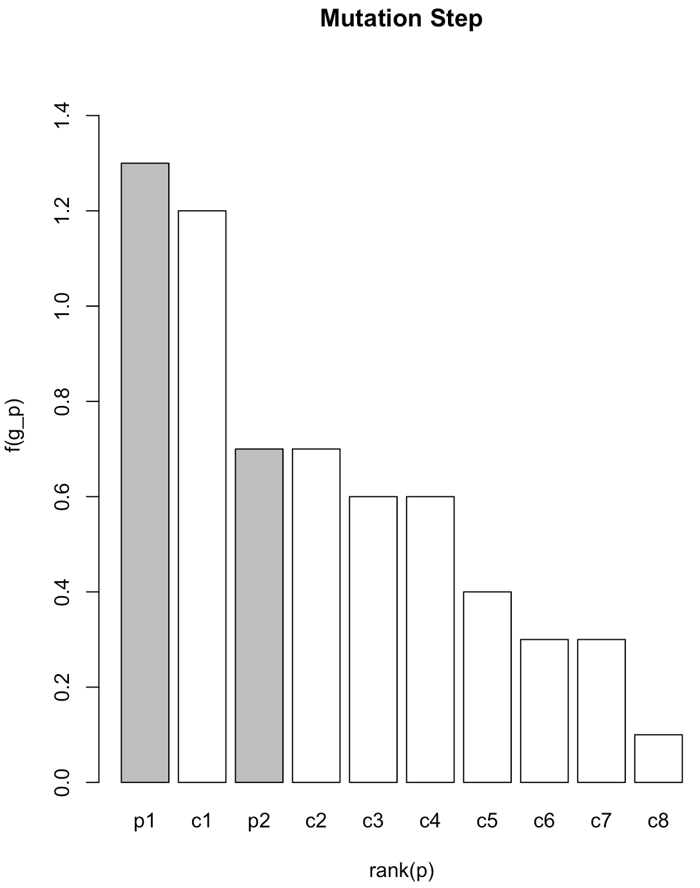

### A51. Typical performance graph.
w/ deterministic rank based, elitism, (μ + λ) strategy, no mutation for parents

it never goes down because the best fitness value of the prior generation is kept in the current generation - due to elitism and (μ + λ) strategy with no mutation for parents.

### A52. Hamming-Cliffs w.r.t. EA
**Hamming Cliff**: It is produced when the binary coding of two adjacent values differs in each one of their bits. e.g.) 01111 and 10000 represent the values 31 and 32, respectively, and the values of each one of their positions are different.

By Creeping up and down, real-coded GAs can easily do hillclimbing in the underlying decision space, but with bitwise complement (bit-flipping) mutation, binary coded-genes can become stuck on Hamming cliffs.

The hamming cliff may produce problems under some conditions, such as the convergence towards no global optimum.

**[Reference]**

* K. K. Roopesh,  P.K. Umesha and  M.S. Kalappa, "Software based on heuristic technique for optimization of transmission line towers", 2006
* Goldberg, D.E., “Real-Coded Genetic Algorithms, Virtual Alphabets, and Blocking”, 1991

### A53.

### A54. Advantages of EA

* Applicable in problems where no (good) method is
available:
	* Discontinuities, non-linear constraints, multi-modalities.
	* Discrete variable space.
	* Noisy problems.
* Most suitable in problems where multiple solutions are required:
	* Multi-modal optimization problems.
	* Multi-objective optimization problems.
* Parallel implementation is easier.

### A56. Overall idea of evolutionary algorithms

Our **objective** is to have a good chocolate bar. We have 50 possible
ingredients (let's say `A, B, C, D, ..., AA, AB, AC, ..., AX`) , but we can only
use 20 of them in each bar. That is, the size of our search space is `50
Combination 20`.

In the **initialization** phase we can create 50 different chocolate bars
(`individuals`), each one with a different combination of ingredients
(`genomes`).

| Pieces/Ingredients | In1 | In2 | ... |In20 |
|--------------------|-----|-----|-----|-----|
| Piece 01           | A   | B   | ... | AX  |
| Piece 02           | E   | H   | ... | C   |
| ...                | ... | ... | ... | ... |
| Piece 03           | A   | AD  | ... | AE  |

**Fitness evaluation**. Some guys will taste our 50 pieces of chocolate, they
will rate each piece, (let's say from 0 to 10). At the end each chocolate will
score the average of the ratings

| Pieces/Guys        | 1   | 2   | ... | n   | **fitness function** |
|--------------------|-----|-----|-----|-----|----------------------|
| Piece 01           | 10  | 8   | ... | 6.9 |   8.4                |
| Piece 02           | 9   | 7   | ... | 3.3 |   6.1                |
| ...                | ... | ... | ... | ... |   8.7                |
| Piece 03           | 9.9 | 9   | ... | 7.6 |   4.2                |

**External selection**. We will discard the pieces of chocolate with lower
fitness (&lambda;), and we will stay with the rest of the pieces (&mu;
`survivors`).

**Parent selection**. From the &mu; pieces of chocolates we have, we choose two
of them (`parents`)

**Inheritance**. To produce new pieces of chocolate, we will use the
`recombination by union of sets`,  from the new set we choose the first 20
elements.

**Mutation**. We choose one ingredient (or more) and we replace it with another
ingredient from the set of the rest 30 ingredients.
